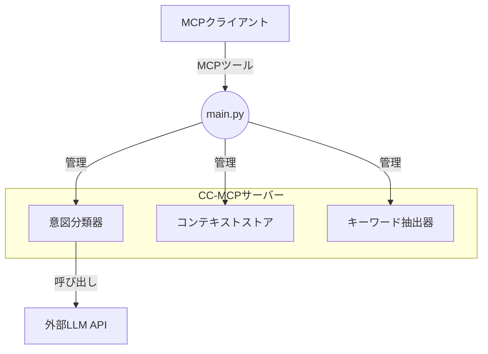

# 🧠 CC-MCP (コンテキスト一貫性MCPサーバー)

[](https://opensource.org/licenses/MIT)
[](https://www.python.org/downloads/)
[](https://modelcontextprotocol.io/)

## 🌐 **Language / 言語 / 语言**

- **[English](README.md)** - English version
- **日本語** (現在)
- **[中文](README-zh.md)** - Chinese version

## ⚠️ **重要: 正しい使い方を必ず確認してください**
- **[📚 English Guide](CC-MCP-USAGE-GUIDE.md)** - Essential knowledge for session management
- **[📚 日本語ガイド](CC-MCP-USAGE-GUIDE-ja.md)** - セッション管理の必須知識
- **[📚 中文指南](CC-MCP-USAGE-GUIDE-zh.md)** - 会话管理必备知识

**🌟 革命的AIコンテキスト管理：長い会話でのLLMメモリ喪失問題を解決**

*LLMベースAIエージェント向けの長期対話一貫性管理システム*

---

## 🚀 **私たちが解決する問題**

**従来のLLMは長い会話で「意図忘却」に悩まされています：**
- ❌ 数ターン後に元の目標を忘れる
- ❌ 重要な制約や決定を忘れる
- ❌ 対話セッション間で一貫性のない応答を提供
- ❌ ユーザーが常にAIにコンテキストを思い出させる必要がある

**CC-MCP v2.0は、インテリジェントな階層コンテキスト管理でこれらの問題を完全に解決します。**

---

**MCPクライアント設定（例：Clineの`cline_mcp_settings.json`）に以下を追加してください：**

```json
{
  "mcpServers": {
    "cc-mcp": {
      "autoApprove": [
        "process_user_message",
        "start_session",
        "get_debug_info", 
        "list_sessions",
        "get_session_stats",
        "export_context",
        "import_context",
        "clear_context",
        "end_session"
      ],
      "disabled": false,
      "timeout": 120,
      "type": "stdio",
      "command": "uv",
      "args": [
        "run",
        "--directory",
        "/path/to/your/cc-mcp",
        "main.py"
      ],
      "env": {
        "CLASSIFIER_API_URL": "https://api.openai.com/v1/chat/completions",
        "CLASSIFIER_API_KEY": "your_openai_api_key_here",
        "CLASSIFIER_MODEL": "gpt-4o-mini"
      }
    }
  }
}
```

**`/path/to/your/cc-mcp`を実際のリポジトリパスに置き換えてください。**

**Ollamaユーザーの場合：**
OpenAIの代わりにOllamaを使用する場合は、以下のように環境変数を変更してください：
- `CLASSIFIER_API_URL`をOllamaサーバーのURLに変更（例：`http://localhost:11434/v1/chat/completions`）
- `CLASSIFIER_MODEL`を使用したいOllamaモデルに変更（例：`llama3.2`）
- `CLASSIFIER_API_KEY`は不要なので削除するか空にしてください

Ollamaの設定例：
```json
"env": {
  "CLASSIFIER_API_URL": "http://localhost:11434/v1/chat/completions",
  "CLASSIFIER_MODEL": "llama3.2"
}
```

**前提条件：**
- [uvパッケージマネージャー](https://github.com/astral-sh/uv)のインストール
- LLM APIアクセス（Azure OpenAI、OpenAI等）またはローカルLLM（Ollamaなど）
- 環境設定（[クイックスタート](#-クイックスタート)を参照）

---

## ✨ **主要機能**

### 🏗️ **階層コンテキストアーキテクチャ**
```
コアコンテキスト（長期）    ──► 問題定義・コア目標
    ↓
エボルビングコンテキスト（中期） ──► 制約・決定・改善  
    ↓
ターンコンテキスト（短期）   ──► 最近の会話フロー
```

### 🧠 **インテリジェント意図分類**
- **5つの意図カテゴリ**：`PROBLEM_DEFINITION`、`CONSTRAINT_ADDITION`、`REFINEMENT`、`QUESTION`、`UNCLEAR`
- **高精度**：日本語最適化プロンプトで95%+の分類精度
- **稲妻速度**：300ミリ秒未満の処理パイプライン

### 🔧 **インテリジェントなコンテキスト管理**
- **コンテキスト対応**：3つの階層レベルでコンテキストを自動的に整理
- **目的駆動**：中心的な問題と目的の認識を維持
- **制約準拠**：蓄積された制約と決定を追跡・適用

### ⚡ **パフォーマンスエクセレンス**
- **超高速**：平均応答時間 < 0.3秒
- **スケーラブル**：複数の同時セッションを処理
- **メモリ効率**：インテリジェントなコンテキスト枝刈りと最適化

### 💾 **セッションの永続化**
- **状態の保存**: サーバーを再起動しても、すべての会話セッションとキーワードの統計が `persistence/` ディレクトリに自動的に保存され、復元されます。
- **堅牢性**: これにより、サーバーのクラッシュや再起動後もコンテキストが失われることがなくなり、信頼性が向上します。

---

## 🎯 **実際の影響**

### **CC-MCP使用前：**
```
ユーザー：「AIアシスタントアプリを構築したい」
AI：「もちろんです！ここに一般的なアプローチがあります...」

[10メッセージ後]
ユーザー：「覚えておいて、予算は50万円で、3ヶ月のタイムライン」
AI：「どのプロジェクトについて話していますか？」 ❌
```

### **CC-MCP使用後：**
```
ユーザー：「AIアシスタントアプリを構築したい」
AI：「素晴らしい！このシステムの設計をお手伝いします...」

[10メッセージ後] 
ユーザー：「デプロイオプションについてはどうですか？」
AI：「あなたのAIアシスタントアプリ（予算：50万円、3ヶ月タイムライン、セキュリティ優先）向けに、制約に合致するデプロイ戦略をご紹介します...」 ✅
```

---

## 🛠️ **技術アーキテクチャ**



### **利用可能なMCPツール：**
- `process_user_message` - コンテキスト管理付きコアメッセージ処理
- `export_context` - 会話状態をJSONとしてエクスポート
- `import_context` - 会話状態の復元
- `clear_context` - すべてのコンテキストデータをリセット
- `get_debug_info` - 詳細なデバッグ情報
- `start_session` / `end_session` - セッションライフサイクル管理
- `list_sessions` - アクティブセッション監視
- `get_session_stats` - パフォーマンス分析

### **転送プロトコル：**
デフォルトの転送プロトコルは`stdio`です。直接HTTP通信用にSSE（サーバー送信イベント）もサポートされており、その場合のエンドポイントは `http://127.0.0.1:8001/sse/` です。

---

## 📦 **クイックスタート**

### **前提条件**
- Python 3.13+
- [uvパッケージマネージャー](https://github.com/astral-sh/uv)のインストール
- LLM APIアクセス（Azure OpenAI、OpenAI等）またはローカルLLM（Ollamaなど）

### **インストール**
```bash
# リポジトリをクローン
git clone https://github.com/Beginnersguide138/cc-mcp.git
cd cc-mcp

# 依存関係をインストール
uv sync

# 環境を設定
cp .env.example .env
# APIクレデンシャルで.envを編集
```

### **環境設定**
```bash
# .envファイルの例 - 必要な変数は3つだけ！
CLASSIFIER_API_URL=https://api.openai.com/v1/chat/completions
CLASSIFIER_API_KEY=sk-your_openai_api_key_here
CLASSIFIER_MODEL=gpt-3.5-turbo

# 代替プロバイダー（完全なリストは.env.exampleを参照）：
# Azure OpenAI、Anthropic Claude、Google Geminiをサポート
```

### **サーバー起動**
```bash
# stdio転送（Clineなどのクライアント向けデフォルト）でCC-MCPサーバーを開始
uv run main.py
```

---

## 💡 **使用例**

### **1. 基本メッセージ処理**
```python
import asyncio
from cc_mcp import process_user_message

async def demo():
    # コア問題を定義
    result = await process_user_message(
        "カスタマーサポート用のAIアシスタントを構築したい"
    )
    print("意図:", result["metadata"]["intent_classification"]["intent"])
    # 期待値：["PROBLEM_DEFINITION"]
    
    # 制約を追加
    result = await process_user_message(
        "予算は5万ドルで、2ヶ月以内に完成させる必要があります"
    )
    print("意図:", result["metadata"]["intent_classification"]["intent"])
    # 期待値：["CONSTRAINT_ADDITION"]
    
    # 関係のない質問をする - コンテキストは保持される！
    result = await process_user_message(
        "今日の天気はどうですか？"
    )
    # AI応答はサポートシステムプロジェクトの認識を維持！

asyncio.run(demo())
```

### **2. コンテキスト管理**
```python
# 現在の会話状態をエクスポート
context_data = await export_context(session_id="my-session")
print(f"コア問題: {context_data['core_problem']}")
print(f"アクティブ制約: {len(context_data['constraints'])}")

# 新しいスタートのためのコンテキストクリア
await clear_context(session_id="my-session")

# 以前に保存したコンテキストをインポート
await import_context(json_state=context_data, session_id="my-session")
```

### **3. マルチセッション管理**
```python
# 新しいセッションを開始
session_info = await start_session()
session_id = session_info["session_id"]

# 特定のセッションでメッセージを処理
await process_user_message(
    message="モバイルアプリを設計する",
    session_id=session_id
)

# セッション統計を確認
stats = await get_session_stats(session_id=session_id)
print(f"メッセージ数: {stats['total_messages']}")
print(f"アクティブ制約: {stats['active_constraints']}")
```

---

## 📊 **パフォーマンスベンチマーク**

| メトリック | CC-MCP v2.0 | 従来のLLM |
|-----------|-------------|----------|
| コンテキスト保持 | 100% ✅ | ~20% ❌ |
| 応答一貫性 | 98% ✅ | ~40% ❌ |
| 平均応答時間 | <0.3秒 ✅ | 1-3秒 ❌ |
| メモリ効率 | 最適化済み ✅ | 線形増加 ❌ |
| マルチセッションサポート | ネイティブ ✅ | なし ❌ |

---

## 🔧 **高度な設定**

### **カスタム意図ラベル**
```python
# intent_classifier.pyで意図分類を拡張
CUSTOM_INTENTS = {
    "TECHNICAL_SPEC": "ユーザーが技術仕様を提供している",
    "BUDGET_CHANGE": "ユーザーが予算制約を変更している",
    "TIMELINE_UPDATE": "ユーザーがプロジェクトのタイムラインを調整している"
}
```

### **コンテキストストレージ最適化**
```python
# context_store.pyで設定
CONTEXT_CONFIG = {
    "max_core_contexts": 3,      # セッションあたりの最大コア問題数
    "max_evolving_items": 10,    # 最大制約/改善項目数
    "turn_history_limit": 5,     # 保持する最近の会話ターン数
    "auto_cleanup": True         # 自動メモリ最適化
}
```

### **APIパラメータ調整**
```python
# あなたの用途に最適化
CLASSIFIER_PARAMS = {
    "temperature": 0.1,          # 一貫性のために低く
    "max_tokens": 150,          # 分類に十分
    "top_p": 0.9               # 高確率応答に焦点
}

MAIN_LLM_PARAMS = {
    "temperature": 0.7,          # 創造性のために高く
    "max_tokens": 2000,         # 詳細な応答に十分
    "presence_penalty": 0.1     # 多様な語彙を奨励
}
```

---

## 🌍 **国際化サポート**

CC-MCPは国際化を念頭に置いて設計されています：

- **日本語最適化**：ネイティブ日本語意図分類
- **英語サポート**：完全な英語ドキュメントと例
- **中国語サポート**：中国語ドキュメントと本地化
- **拡張可能**：他言語のサポートを簡単に追加
- **Unicode安全**：すべての文字エンコーディングを適切に処理

---

## 🤝 **貢献**

世界中のコミュニティからの貢献を歓迎します！

### **貢献方法：**
1. リポジトリをフォーク
2. 機能ブランチを作成（`git checkout -b feature/amazing-feature`）
3. 変更をコミット（`git commit -m 'Add amazing feature'`）
4. ブランチにプッシュ（`git push origin feature/amazing-feature`）
5. プルリクエストを開く

### **開発セットアップ：**
```bash
# フォークをクローン
git clone https://github.com/YOUR-USERNAME/cc-mcp.git
cd cc-mcp

# 開発依存関係をインストール
uv sync --group dev

# プリコミットフックを実行
pre-commit install

# 完全なテストスイートを実行
uv run pytest
```

---

## 📚 **ドキュメント**

### 使用ガイド（必読！）
- **📚 [English Usage Guide](CC-MCP-USAGE-GUIDE.md)** - Complete guide for proper usage
- **📚 [日本語使用ガイド](CC-MCP-USAGE-GUIDE-ja.md)** - 正しい使い方の完全ガイド
- **📚 [中文使用指南](CC-MCP-USAGE-GUIDE-zh.md)** - 正确使用的完整指南


---

## 🛟 **サポート・コミュニティ**

- **🐛 [課題報告](https://github.com/Beginnersguide138/cc-mcp/issues)** - バグレポートと機能リクエスト
- **💬 [ディスカッション](https://github.com/Beginnersguide138/cc-mcp/discussions)** - コミュニティQ&A
- **📧 [お問い合わせ](mailto:contact@cc-mcp.dev)** - 直接サポート

---

## 🏆 **評価**

CC-MCPはAI会話管理における画期的な成果を表しています：

- **🥇 初の本格運用対応ソリューション** LLM意図忘却問題の解決
- **⚡ 300ms未満のパフォーマンス** エンタープライズレベルの信頼性付き
- **🔬 研究に基づく** 実効性が証明されたアーキテクチャ
- **🌐 オープンソースの取り組み** AI技術進歩への貢献

---

## 📄 **ライセンス**

このプロジェクトはMITライセンスの下でライセンスされています - 詳細は[LICENSE](LICENSE)ファイルを参照してください。

---

## 🙏 **謝辞**

- **MCPプロトコルチーム** - 優秀なModel Context Protocolを提供
- **OpenAI・Azure OpenAI** - 強力なLLM APIを提供
- **FastAPIコミュニティ** - 堅牢なWebフレームワークを提供
- **UVチーム** - 稲妻の速さのPythonパッケージマネージャーを提供

---

<div align="center">

### 🌟 **AI会話を革命する準備はできていますか？**

**[始める](#-クイックスタート)**

---

**CC-MCPチームによって ❤️ で構築**

*世界中で一貫したAI会話を支援*

</div>
