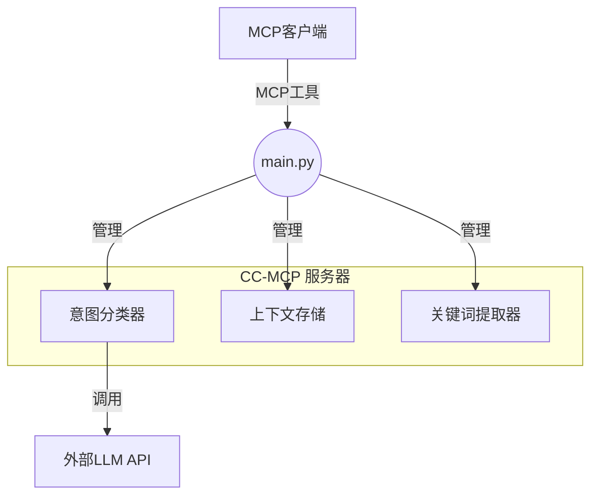

# 🧠 CC-MCP (上下文一致性 MCP 服务器)

[](https://opensource.org/licenses/MIT)
[](https://www.python.org/downloads/)
[](https://modelcontextprotocol.io/)

**🌟 革命性 AI 上下文管理：解决长对话中 LLM 记忆丢失问题**

*面向 LLM 驱动 AI 代理的长期对话一致性管理系统*

---

## 🚀 **我们解决的问题**

**传统 LLM 在长对话中存在"意图遗忘"问题：**
- ❌ 经过几轮对话后忘记最初目标
- ❌ 忘记重要约束和决定
- ❌ 在对话会话中提供不一致的响应
- ❌ 需要用户不断提醒 AI 上下文

**CC-MCP 提供智能上下文管理工具，帮助MCP客户端保持一致性。**

---

**将此添加到您的 MCP 客户端设置（例如 Cline 的 `cline_mcp_settings.json`）：**

```json
{
  "mcpServers": {
    "cc-mcp": {
      "autoApprove": [
        "process_user_message",
        "start_session",
        "get_debug_info", 
        "list_sessions",
        "get_session_stats",
        "export_context",
        "import_context"
      ],
      "disabled": false,
      "timeout": 120,
      "type": "stdio",
      "command": "uv",
      "args": [
        "run",
        "--directory",
        "/path/to/your/cc-mcp",
        "main.py"
      ],
      "env": {
        "CLASSIFIER_API_URL": "https://api.openai.com/v1/chat/completions",
        "CLASSIFIER_API_KEY": "your_openai_api_key_here",
        "CLASSIFIER_MODEL": "gpt-4o-mini"
      }
    }
  }
}
```

**将 `/path/to/your/cc-mcp` 替换为你的实际仓库路径。**

**对于 Ollama 用户：**
当使用 Ollama 而不是 OpenAI 时，请按如下方式修改环境变量：
- 将 `CLASSIFIER_API_URL` 更改为 Ollama 服务器 URL（例如：`http://localhost:11434/v1/chat/completions`）
- 将 `CLASSIFIER_MODEL` 更改为你想要的 Ollama 模型（例如：`llama3.2`）
- 移除或留空 `CLASSIFIER_API_KEY`，因为 Ollama 不需要它

Ollama 配置示例：
```json
"env": {
  "CLASSIFIER_API_URL": "http://localhost:11434/v1/chat/completions",
  "CLASSIFIER_MODEL": "llama3.2"
}
```

**前置条件：**
- 安装 [uv 包管理器](https://github.com/astral-sh/uv)
- LLM API 访问权限（OpenAI、Azure OpenAI 等）
- 环境配置（参见[快速开始](#-快速开始)）

---

## ✨ **核心功能**

### 🏗️ **分层上下文架构**
```
核心上下文（长期）    ──► 问题定义和核心目标
    ↓
演化上下文（中期） ──► 约束、决定和优化  
    ↓
轮次上下文（短期）   ──► 近期对话流
```

### 🧠 **智能意图分类**
- **5 种意图类别**：`PROBLEM_DEFINITION`、`CONSTRAINT_ADDITION`、`REFINEMENT`、`QUESTION`、`UNCLEAR`

#### **详细意图说明（在`intent_classifier.py`中定义）：**
分类逻辑基于一个提示词，指导LLM分析用户消息并分配以下标签之一：

- **`PROBLEM_DEFINITION`**: 用户正在定义他们想要解决的核心问题。
  - *提示词示例*: "我想用AI自动总结会议记录，有什么好方法吗？"

- **`CONSTRAINT_ADDITION`**: 用户正在添加约束或条件，如预算或时间线。
  - *提示词示例*: "听起来不错。但是，请将使用的模型限制在开源的。"

- **`REFINEMENT`**: 用户正在使现有要求更具体或正在修改它。

- **`QUESTION`**: 用户正在询问简单问题。

- **`UNCLEAR`**: 消息无法清楚地分类到上述任何类别中。

### 🔧 **智能上下文管理**
- **上下文感知**：自动在三个层次结构中组织上下文
- **目标驱动**：保持对核心问题和目标的认知
- **约束兼容**：跟踪和应用累积的约束和决策

#### **内存管理的实现方式：**
"智能上下文修剪和优化"通过`HierarchicalContextStore`（`context_store.py`）内的多方面方法实现：

1.  **分层上下文存储**: 系统将信息分类为三个层级，防止上下文退化：
    -   **核心上下文**: 保存主要问题定义，确保主要目标永不丢失。
    -   **演化上下文**: 存储约束和改进列表，允许解决方案空间被逐步缩小。
    -   **轮次上下文**: 保存最后几轮对话的短期记忆，维持即时对话流程。

2.  **自动轮次上下文修剪**: 为防止内存膨胀，`turn_context`被自动修剪。`_trim_turn_context()`方法确保只保留最近的消息（默认：6条），丢弃较旧的、不太相关的轮次。

3.  **基于关键词的优化**: 系统不依赖完整的文本历史，而是为`Core`和`Evolving`上下文提取并存储加权关键词。`get_context_summary()`方法然后提供一个压缩的、关键词驱动的摘要给LLM，这比原始对话历史更高效处理。

这种结构化的、基于规则的方法确保内存得到高效和智能的管理，保持最关键的信息可访问而不会使LLM负担过重。

### 📊 **统计关键词提取**
- **TF-IDF驱动**: 使用TF-IDF算法识别并提取对话中最重要的关键词。
- **上下文摘要**: 为核心问题和演化约束提供基于关键词的压缩摘要，这对LLM来说更高效处理。
- **动态语料库**: 关键词提取引擎持续更新其文档语料库，随着每次新对话提高其IDF计算的准确性。

#### **关键词提取的实现方式（在`keyword_extraction.py`中定义）：**
统计关键词提取使用了具有多项优化的复杂TF-IDF实现：

1. **词频（TF）计算**: `_calculate_tf()`方法计算特定消息中每个词语相对于该消息总词数的出现频率。这识别了在当前上下文中被强调的词语。

2. **逆文档频率（IDF）计算**: `_calculate_idf()`方法确定一个词语在语料库中所有对话中的稀有程度。使用的公式是`IDF = log(总文档数 / 包含该词的文档数)`，使稀有词语更有价值。

3. **TF-IDF评分**: `extract_keywords()`方法结合TF和IDF分数（`TF-IDF = TF × IDF`）来识别在当前消息中频繁出现但在所有对话中稀有的词语，表明主题特定的重要性。

4. **多语言标记化**: `_tokenize()`方法使用正则表达式模式提取日语（平假名、片假名、汉字）和英语单词，同时过滤两种语言中的常见停用词。

5. **语料库管理**: 系统维护一个不断增长的文档语料库，随时间提高IDF准确性。每条新消息都会更新`_document_frequency`字典和`_total_documents`计数，使未来的提取更加精确。

这种方法确保提取的关键词代表最具上下文相关性的术语，同时过滤掉常见的、意义较少的词语。

### ⚡ **卓越性能**
- **超快速**：平均响应时间 < 0.3 秒
- **可扩展**：处理多个并发会话
- **内存高效**：智能上下文修剪和优化

### 💾 **会话持久化**
- **状态化操作**: 所有的会话和关键词统计信息都会自动保存到 `persistence/` 目录中，并在服务器重启后恢复，确保数据不会丢失。
- **稳健性**: 这使得服务器具有弹性，即使在服务器崩溃或重启后也能保持上下文。

---

## 🎯 **实际影响**

### **使用 CC-MCP 之前：**
```
用户："我想构建一个 AI 助手应用"
AI："当然！这里有一些通用方法..."

[10 条消息后]
用户："记住，预算是 50 万日元，3 个月时间限制"
AI："我们在谈论什么项目？" ❌
```

### **使用 CC-MCP 之后：**
```
用户："我想构建一个 AI 助手应用"
AI："太好了！让我帮你设计这个系统..."

[10 条消息后] 
用户："部署选项怎么样？"
AI："对于您的 AI 助手应用（预算：50万日元，3个月时间限制，安全优先），这里是符合您约束条件的部署策略..." ✅
```

---

## 🛠️ **技术架构**



#### **组件描述：**
该服务器建立在三个协同工作提供上下文感知响应的核心组件之上：

1.  **`意图分类器` (`intent_classifier.py`)**：
    -   **功能**: 该组件分析用户的消息以确定其根本目的。
    -   **实现**: 它将用户的消息发送给外部LLM（如GPT或本地Ollama模型），并使用精心制作的提示词要求LLM将消息分类为五种意图之一：`PROBLEM_DEFINITION`、`CONSTRAINT_ADDITION`、`REFINEMENT`、`QUESTION`或`UNCLEAR`。

2.  **`上下文存储` (`context_store.py`)**：
    -   **功能**: 这是系统的"记忆"。它在分层结构中组织和存储对话上下文。
    -   **实现**: 它使用三层系统：用于主要问题的`core_context`、用于约束和改进的`evolving_context`，以及用于最近消息的`turn_context`。它自动修剪短期的`turn_context`以高效管理内存。

3.  **`关键词提取器` (`keyword_extraction.py`)**：
    -   **功能**: 该引擎从存储在`core`和`evolving`上下文中的用户消息中识别最重要的术语。
    -   **实现**: 它使用经典的**TF-IDF（词频-逆文档频率）**算法。它计算单词在消息中出现的频率（TF）以及该单词在所有对话中的稀有程度（IDF）。这些分数的组合使其能够确定对当前主题唯一重要的关键词。

### **可用的 MCP 工具：**
- `process_user_message` - 带上下文管理的核心消息处理
- `export_context` - 将对话状态导出为 JSON
- `import_context` - 恢复对话状态
- `clear_context` - 重置所有上下文数据
- `get_debug_info` - 详细调试信息
- `start_session` / `end_session` - 会话生命周期管理
- `list_sessions` - 活动会话监控
- `get_session_stats` - 性能分析

### **传输协议：**
默认传输协议是 `stdio`。也支持用于直接 HTTP 通信的 SSE（服务器发送事件），其端点为 `http://127.0.0.1:8001/sse/`。

---

## 📦 **快速开始**

### **前置条件**
- Python 3.13+
- [uv 包管理器](https://github.com/astral-sh/uv)
- LLM API 访问权限（Azure OpenAI、OpenAI 等）或本地 LLM (Ollama 等)

### **安装**
```bash
# 克隆仓库
git clone https://github.com/Beginnersguide138/cc-mcp.git
cd cc-mcp

# 安装依赖
uv sync

# 配置环境
cp .env.example .env
# 用您的 API 凭据编辑 .env 文件
```

### **环境配置**
```bash
# .env 文件示例 - 只需要 3 个变量！
CLASSIFIER_API_URL=https://api.openai.com/v1/chat/completions
CLASSIFIER_API_KEY=sk-your_openai_api_key_here
CLASSIFIER_MODEL=gpt-3.5-turbo

# 替代提供商（完整列表请参见 .env.example）：
# 支持 Azure OpenAI、Anthropic Claude、Google Gemini
```

### **启动服务器**
```bash
# 使用 stdio 传输（Cline等客户端的默认方式）启动 CC-MCP 服务器
uv run main.py
```

---

## 💡 **使用示例**

### **1. 基础消息处理**
```python
import asyncio
from cc_mcp import process_user_message

async def demo():
    # 定义核心问题
    result = await process_user_message(
        "我想为客户支持构建一个 AI 助手"
    )
    print("意图:", result["metadata"]["intent_classification"]["intent"])
    # 预期：["PROBLEM_DEFINITION"]
    
    # 添加约束
    result = await process_user_message(
        "预算是 5 万美元，必须在 2 个月内完成"
    )
    print("意图:", result["metadata"]["intent_classification"]["intent"])
    # 预期：["CONSTRAINT_ADDITION"]
    
    # 问不相关的问题 - 上下文仍然保持！
    result = await process_user_message(
        "今天天气怎么样？"
    )
    # AI 响应仍将保持对支持系统项目的认知！

asyncio.run(demo())
```

### **2. 上下文管理**
```python
# 导出当前对话状态
context_data = await export_context(session_id="my-session")
print(f"核心问题: {context_data['core_problem']}")
print(f"活动约束: {len(context_data['constraints'])}")

# 清除上下文以重新开始
await clear_context(session_id="my-session")

# 导入先前保存的上下文
await import_context(json_state=context_data, session_id="my-session")
```

### **3. 多会话管理**
```python
# 开始新会话
session_info = await start_session()
session_id = session_info["session_id"]

# 在特定会话中处理消息
await process_user_message(
    message="设计一个移动应用",
    session_id=session_id
)

# 检查会话统计
stats = await get_session_stats(session_id=session_id)
print(f"消息数: {stats['total_messages']}")
print(f"活动约束: {stats['active_constraints']}")
```

---

## 🔧 **高级配置**

### **自定义意图标签**
```python
# 在 intent_classifier.py 中扩展意图分类
CUSTOM_INTENTS = {
    "TECHNICAL_SPEC": "用户正在提供技术规格",
    "BUDGET_CHANGE": "用户正在修改预算约束",
    "TIMELINE_UPDATE": "用户正在调整项目时间表"
}
```

### **上下文存储优化**
```python
# 在 context_store.py 中配置
CONTEXT_CONFIG = {
    "max_core_contexts": 3,      # 每个会话的最大核心问题数
    "max_evolving_items": 10,    # 最大约束/优化项数
    "turn_history_limit": 5,     # 保留的近期对话轮数
    "auto_cleanup": True         # 自动内存优化
}
```

### **API 参数调优**
```python
# 针对您的用例进行优化
CLASSIFIER_PARAMS = {
    "temperature": 0.1,          # 降低以保持一致性
    "max_tokens": 150,          # 分类足够
    "top_p": 0.9               # 关注高概率响应
}

MAIN_LLM_PARAMS = {
    "temperature": 0.7,          # 提高创造性
    "max_tokens": 2000,         # 为详细响应提供充足空间
    "presence_penalty": 0.1     # 鼓励多样化词汇
}
```

---

## 🌍 **国际化支持**

CC-MCP 在设计时考虑了国际化：

- **日语优化**：原生日语意图分类
- **英语支持**：完整的英语文档和示例
- **中文支持**：提供中文文档和本地化
- **可扩展**：易于添加对其他语言的支持
- **Unicode 安全**：正确处理所有字符编码

---

## 🤝 **贡献**

我们欢迎全球社区的贡献！

### **如何贡献：**
1. Fork 这个仓库
2. 创建功能分支（`git checkout -b feature/amazing-feature`）
3. 提交您的更改（`git commit -m 'Add amazing feature'`）
4. 推送到分支（`git push origin feature/amazing-feature`）
5. 打开 Pull Request

### **开发设置：**
```bash
# 克隆您的 fork
git clone https://github.com/YOUR-USERNAME/cc-mcp.git
cd cc-mcp

# 安装开发依赖
uv sync --group dev

# 运行预提交钩子
pre-commit install

# 运行完整测试套件
uv run pytest
```

---

## 📚 **文档**

- **[📚 English Guide](CC-MCP-USAGE-GUIDE.md)** - Essential knowledge for session management
- **[📚 日本語ガイド](CC-MCP-USAGE-GUIDE-ja.md)** - セッション管理の必須知識
- **[📚 中文指南](CC-MCP-USAGE-GUIDE-zh.md)** - 会话管理必备知识

---

## 🛟 **支持与社区**

- **🐛 [报告问题](https://github.com/Beginnersguide138/cc-mcp/issues)** - 错误报告和功能请求
- **💬 [讨论](https://github.com/Beginnersguide138/cc-mcp/discussions)** - 社区问答
- **📧 [联系方式](mailto:contact@cc-mcp.dev)** - 直接支持

---

## 🏆 **认可**

CC-MCP 代表了 AI 对话管理的突破：

- **🥇 首个生产就绪解决方案** 解决 LLM 意图遗忘问题
- **⚡ 300毫秒以下性能** 具有企业级可靠性  
- **🔬 研究支撑** 经过验证的有效架构
- **🌐 开源承诺** 致力于推进 AI 技术

---

## 📄 **许可证**

此项目根据 MIT 许可证授权 - 详细信息请参见 [LICENSE](LICENSE) 文件。

---

## 🙏 **致谢**

- **MCP 协议团队** - 提供优秀的模型上下文协议
- **OpenAI 和 Azure OpenAI** - 提供强大的 LLM API
- **FastAPI 社区** - 提供强大的 Web 框架
- **UV 团队** - 提供闪电般快速的 Python 包管理器

---

<div align="center">

### 🌟 **准备好革新您的 AI 对话了吗？**

**[开始使用](#-快速开始)**

---

**由 CC-MCP 团队用 ❤️ 构建**

*在全球范围内为一致的 AI 对话赋能*

</div>
