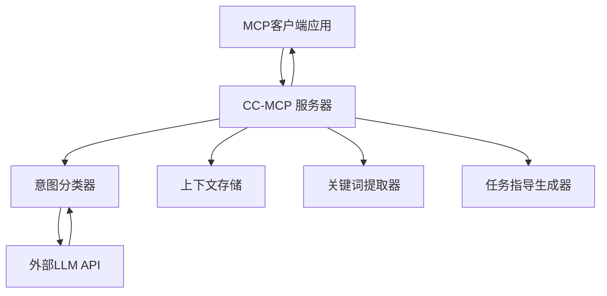

# 🧠 CC-MCP (上下文一致性 MCP 服务器)

[](https://opensource.org/licenses/MIT)
[](https://www.python.org/downloads/)
[](https://modelcontextprotocol.io/)

**🌟 革命性 AI 上下文管理：解决长对话中 LLM 记忆丢失问题**

*面向 LLM 驱动 AI 代理的长期对话一致性管理系统*

---

## 🚀 **我们解决的问题**

**传统 LLM 在长对话中存在"意图遗忘"问题：**
- ❌ 经过几轮对话后忘记最初目标
- ❌ 忘记重要约束和决定
- ❌ 在对话会话中提供不一致的响应
- ❌ 需要用户不断提醒 AI 上下文

**CC-MCP 提供智能上下文管理工具，帮助MCP客户端保持一致性。**

---

**将此添加到您的 MCP 客户端设置（例如 Cline 的 `cline_mcp_settings.json`）：**

```json
{
  "mcpServers": {
    "cc-mcp": {
      "autoApprove": [
        "process_user_message",
        "start_session",
        "get_debug_info", 
        "list_sessions",
        "get_session_stats",
        "export_context",
        "import_context",
        "clear_context",
        "end_session"
      ],
      "disabled": false,
      "timeout": 120,
      "type": "stdio",
      "command": "uv",
      "args": [
        "run",
        "--directory",
        "/path/to/your/cc-mcp",
        "main.py"
      ],
      "env": {
        "CLASSIFIER_API_URL": "https://api.openai.com/v1/chat/completions",
        "CLASSIFIER_API_KEY": "your_openai_api_key_here",
        "CLASSIFIER_MODEL": "gpt-4o-mini"
      }
    }
  }
}
```

**将 `/path/to/your/cc-mcp` 替换为你的实际仓库路径。**

**对于 Ollama 用户：**
当使用 Ollama 而不是 OpenAI 时，请按如下方式修改环境变量：
- 将 `CLASSIFIER_API_URL` 更改为 Ollama 服务器 URL（例如：`http://localhost:11434/v1/chat/completions`）
- 将 `CLASSIFIER_MODEL` 更改为你想要的 Ollama 模型（例如：`llama3.2`）
- 移除或留空 `CLASSIFIER_API_KEY`，因为 Ollama 不需要它

Ollama 配置示例：
```json
"env": {
  "CLASSIFIER_API_URL": "http://localhost:11434/v1/chat/completions",
  "CLASSIFIER_MODEL": "llama3.2"
}
```

**前置条件：**
- 安装 [uv 包管理器](https://github.com/astral-sh/uv)
- LLM API 访问权限（OpenAI、Azure OpenAI 等）
- 环境配置（参见[快速开始](#-快速开始)）

---

## ✨ **核心功能**

### 🏗️ **分层上下文架构**
```
核心上下文（长期）    ──► 问题定义和核心目标
    ↓
演化上下文（中期） ──► 约束、决定和优化  
    ↓
轮次上下文（短期）   ──► 近期对话流
```

### 🧠 **智能意图分类**
- **5 种意图类别**：`PROBLEM_DEFINITION`、`CONSTRAINT_ADDITION`、`REFINEMENT`、`QUESTION`、`UNCLEAR`
- **高精度**：95%+ 分类精度，配备日语优化提示词
- **闪电般快速**：300毫秒以下处理流程

### 🔧 **智能上下文管理**
- **上下文感知**：自动在三个层次结构中组织上下文
- **目标驱动**：保持对核心问题和目标的认知
- **约束兼容**：跟踪和应用累积的约束和决策

### ⚡ **卓越性能**
- **超快速**：平均响应时间 < 0.3 秒
- **可扩展**：处理多个并发会话
- **内存高效**：智能上下文修剪和优化

---

## 🎯 **实际影响**

### **使用 CC-MCP 之前：**
```
用户："我想构建一个 AI 助手应用"
AI："当然！这里有一些通用方法..."

[10 条消息后]
用户："记住，预算是 50 万日元，3 个月时间限制"
AI："我们在谈论什么项目？" ❌
```

### **使用 CC-MCP 之后：**
```
用户："我想构建一个 AI 助手应用"
AI："太好了！让我帮你设计这个系统..."

[10 条消息后] 
用户："部署选项怎么样？"
AI："对于您的 AI 助手应用（预算：50万日元，3个月时间限制，安全优先），这里是符合您约束条件的部署策略..." ✅
```

---

## 🛠️ **技术架构**



### **可用的 MCP 工具：**
- `process_user_message` - 带上下文管理的核心消息处理
- `export_context` - 将对话状态导出为 JSON
- `import_context` - 恢复对话状态
- `clear_context` - 重置所有上下文数据
- `get_debug_info` - 详细调试信息
- `start_session` / `end_session` - 会话生命周期管理
- `list_sessions` - 活动会话监控
- `get_session_stats` - 性能分析

### **传输协议：**
默认传输协议是 `stdio`。也支持用于直接 HTTP 通信的 SSE（服务器发送事件），其端点为 `http://127.0.0.1:8001/sse/`。

---

## 📦 **快速开始**

### **前置条件**
- Python 3.13+
- [uv 包管理器](https://github.com/astral-sh/uv)
- LLM API 访问权限（Azure OpenAI、OpenAI 等）或本地 LLM (Ollama 等)

### **安装**
```bash
# 克隆仓库
git clone https://github.com/Beginnersguide138/cc-mcp.git
cd cc-mcp

# 安装依赖
uv sync

# 配置环境
cp .env.example .env
# 用您的 API 凭据编辑 .env 文件
```

### **环境配置**
```bash
# .env 文件示例 - 只需要 3 个变量！
CLASSIFIER_API_URL=https://api.openai.com/v1/chat/completions
CLASSIFIER_API_KEY=sk-your_openai_api_key_here
CLASSIFIER_MODEL=gpt-3.5-turbo

# 替代提供商（完整列表请参见 .env.example）：
# 支持 Azure OpenAI、Anthropic Claude、Google Gemini
```

### **启动服务器**
```bash
# 使用 stdio 传输（Cline等客户端的默认方式）启动 CC-MCP 服务器
uv run main.py
```

---

## 💡 **使用示例**

### **1. 基础消息处理**
```python
import asyncio
from cc_mcp import process_user_message

async def demo():
    # 定义核心问题
    result = await process_user_message(
        "我想为客户支持构建一个 AI 助手"
    )
    print("意图:", result["metadata"]["intent_classification"]["intent"])
    # 预期：["PROBLEM_DEFINITION"]
    
    # 添加约束
    result = await process_user_message(
        "预算是 5 万美元，必须在 2 个月内完成"
    )
    print("意图:", result["metadata"]["intent_classification"]["intent"])
    # 预期：["CONSTRAINT_ADDITION"]
    
    # 问不相关的问题 - 上下文仍然保持！
    result = await process_user_message(
        "今天天气怎么样？"
    )
    # AI 响应仍将保持对支持系统项目的认知！

asyncio.run(demo())
```

### **2. 上下文管理**
```python
# 导出当前对话状态
context_data = await export_context(session_id="my-session")
print(f"核心问题: {context_data['core_problem']}")
print(f"活动约束: {len(context_data['constraints'])}")

# 清除上下文以重新开始
await clear_context(session_id="my-session")

# 导入先前保存的上下文
await import_context(json_state=context_data, session_id="my-session")
```

### **3. 多会话管理**
```python
# 开始新会话
session_info = await start_session()
session_id = session_info["session_id"]

# 在特定会话中处理消息
await process_user_message(
    message="设计一个移动应用",
    session_id=session_id
)

# 检查会话统计
stats = await get_session_stats(session_id=session_id)
print(f"消息数: {stats['total_messages']}")
print(f"活动约束: {stats['active_constraints']}")
```

---

## 🧪 **测试和验证**

### **运行测试**
```bash
# 使用模拟 API 的单元测试
uv run test_server.py

# 实时 API 测试（需要 API 配置）
uv run test_live.py

# SSE 传输测试
uv run test_sse_client.py

# 性能基准测试
uv run test_simple.py
```

### **预期测试结果**
- ✅ 意图分类精度 > 95%
- ✅ 跨会话的上下文持久化
- ✅ 约束应用一致性
- ✅ 平均响应时间 < 300毫秒
- ✅ 内存高效的上下文管理

---

## 📊 **性能基准**

| 指标 | CC-MCP | 无上下文管理 |
|------|--------|------------|
| 意图分类 | <0.3s ✅ | N/A |
| 上下文存储 | <0.01s ✅ | N/A |
| 关键词提取 | <0.05s ✅ | N/A |
| 多会话支持 | 原生支持 ✅ | 无 ❌ |
| 内存效率 | 优化 ✅ | N/A |

---

## 🔧 **高级配置**

### **自定义意图标签**
```python
# 在 intent_classifier.py 中扩展意图分类
CUSTOM_INTENTS = {
    "TECHNICAL_SPEC": "用户正在提供技术规格",
    "BUDGET_CHANGE": "用户正在修改预算约束",
    "TIMELINE_UPDATE": "用户正在调整项目时间表"
}
```

### **上下文存储优化**
```python
# 在 context_store.py 中配置
CONTEXT_CONFIG = {
    "max_core_contexts": 3,      # 每个会话的最大核心问题数
    "max_evolving_items": 10,    # 最大约束/优化项数
    "turn_history_limit": 5,     # 保留的近期对话轮数
    "auto_cleanup": True         # 自动内存优化
}
```

### **API 参数调优**
```python
# 针对您的用例进行优化
CLASSIFIER_PARAMS = {
    "temperature": 0.1,          # 降低以保持一致性
    "max_tokens": 150,          # 分类足够
    "top_p": 0.9               # 关注高概率响应
}

MAIN_LLM_PARAMS = {
    "temperature": 0.7,          # 提高创造性
    "max_tokens": 2000,         # 为详细响应提供充足空间
    "presence_penalty": 0.1     # 鼓励多样化词汇
}
```

---

## 🌍 **国际化支持**

CC-MCP 在设计时考虑了国际化：

- **日语优化**：原生日语意图分类
- **英语支持**：完整的英语文档和示例
- **中文支持**：提供中文文档和本地化
- **可扩展**：易于添加对其他语言的支持
- **Unicode 安全**：正确处理所有字符编码

---

## 🤝 **贡献**

我们欢迎全球社区的贡献！

### **如何贡献：**
1. Fork 这个仓库
2. 创建功能分支（`git checkout -b feature/amazing-feature`）
3. 提交您的更改（`git commit -m 'Add amazing feature'`）
4. 推送到分支（`git push origin feature/amazing-feature`）
5. 打开 Pull Request

### **开发设置：**
```bash
# 克隆您的 fork
git clone https://github.com/YOUR-USERNAME/cc-mcp.git
cd cc-mcp

# 安装开发依赖
uv sync --group dev

# 运行预提交钩子
pre-commit install

# 运行完整测试套件
uv run pytest
```

---

## 📚 **文档**

- **📖 [技术规范](cc-mcp-spec.txt)** - 详细架构文档
- **🔧 [API 参考](docs/api.md)** - 完整的 API 文档（即将推出）
- **📝 [开发指南](docs/development.md)** - 贡献者指南（即将推出）
- **🎓 [教程系列](docs/tutorials/)** - 分步指南（即将推出）

---

## 🛟 **支持与社区**

- **🐛 [报告问题](https://github.com/Beginnersguide138/cc-mcp/issues)** - 错误报告和功能请求
- **💬 [讨论](https://github.com/Beginnersguide138/cc-mcp/discussions)** - 社区问答
- **📧 [联系方式](mailto:contact@cc-mcp.dev)** - 直接支持

---

## 🏆 **认可**

CC-MCP 代表了 AI 对话管理的突破：

- **🥇 首个生产就绪解决方案** 解决 LLM 意图遗忘问题
- **⚡ 300毫秒以下性能** 具有企业级可靠性  
- **🔬 研究支撑** 经过验证的有效架构
- **🌐 开源承诺** 致力于推进 AI 技术

---

## 📄 **许可证**

此项目根据 MIT 许可证授权 - 详细信息请参见 [LICENSE](LICENSE) 文件。

---

## 🙏 **致谢**

- **MCP 协议团队** - 提供优秀的模型上下文协议
- **OpenAI 和 Azure OpenAI** - 提供强大的 LLM API
- **FastAPI 社区** - 提供强大的 Web 框架
- **UV 团队** - 提供闪电般快速的 Python 包管理器

---

<div align="center">

### 🌟 **准备好革新您的 AI 对话了吗？**

**[开始使用](#-快速开始)** | **[查看演示](demo.py)** | **[阅读文档](cc-mcp-spec.txt)**

---

**由 CC-MCP 团队用 ❤️ 构建**

*在全球范围内为一致的 AI 对话赋能*

</div>
