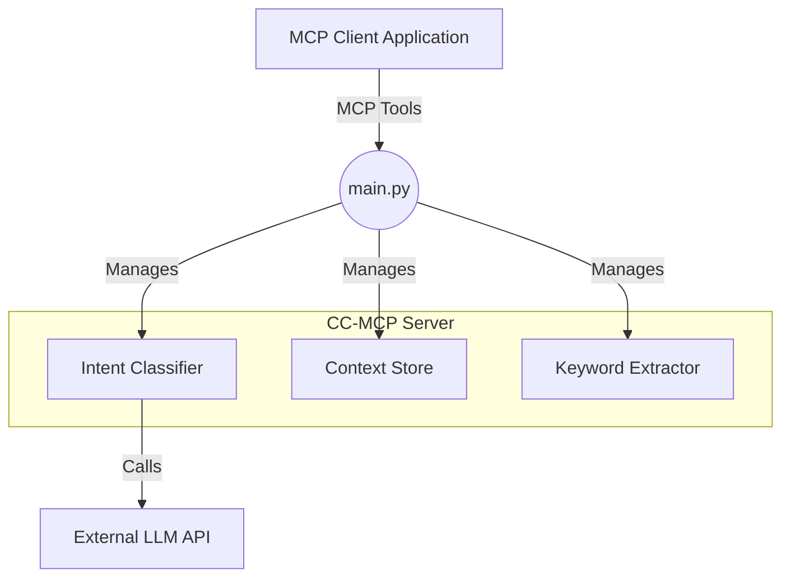

# 🧠 CC-MCP (Context Consistent MCP Server)

[](https://opensource.org/licenses/MIT)
[](https://www.python.org/downloads/)
[](https://modelcontextprotocol.io/)

## 🌐 **Language / 言語 / 语言**

- **English** (Current)
- **[日本語](README-ja.md)** - Japanese version
- **[中文](README-zh.md)** - Chinese version

## ⚠️ **Important: Please Check the Proper Usage Guide**
- **[📚 English Guide](CC-MCP-USAGE-GUIDE.md)** - Essential knowledge for session management
- **[📚 日本語ガイド](CC-MCP-USAGE-GUIDE-ja.md)** - セッション管理の必須知識
- **[📚 中文指南](CC-MCP-USAGE-GUIDE-zh.md)** - 会话管理必备知识

**🌟 Revolutionary AI Context Management: Solving LLM Memory Loss in Long Conversations**

*Long-term conversational consistency management system for LLM-powered AI agents*

---

## 🚀 **The Problem We Solve**

**Traditional LLMs suffer from "intent forgetting" in long conversations:**
- ❌ Lose track of the original goal after a few turns
- ❌ Forget important constraints and decisions
- ❌ Provide inconsistent responses across dialogue sessions
- ❌ Require users to constantly remind the AI of context

**CC-MCP provides intelligent context management tools to help LLM maintain consistency.**

---

**Add this to your MCP client settings (e.g., Cline's `cline_mcp_settings.json`):**

```json
{
  "mcpServers": {
    "cc-mcp": {
      "autoApprove": [
        "process_user_message",
        "start_session",
        "get_debug_info", 
        "list_sessions",
        "get_session_stats",
        "export_context",
        "import_context"
      ],
      "disabled": false,
      "timeout": 60,
      "type": "stdio",
      "command": "uv",
      "args": [
        "run",
        "--directory",
        "/path/to/your/cc-mcp",
        "main.py"
      ],
      "env": {
        "CLASSIFIER_API_URL": "https://api.openai.com/v1/chat/completions",
        "CLASSIFIER_API_KEY": "your_openai_api_key_here",
        "CLASSIFIER_MODEL": "gpt-4o-mini"
      }
    }
  }
}
```

- Environment configured (see [Quick Start](#-quick-start))
**Replace `/path/to/your/cc-mcp` with your actual repository path.**

**For Ollama users:**
When using Ollama instead of OpenAI, modify the environment variables as follows:
- Change `CLASSIFIER_API_URL` to your Ollama server URL (e.g., `http://localhost:11434/v1/chat/completions`)
- Change `CLASSIFIER_MODEL` to your preferred Ollama model (e.g., `llama3.2`)
- Remove or leave empty `CLASSIFIER_API_KEY` as it's not required for Ollama

Example configuration for Ollama:
```json
"env": {
  "CLASSIFIER_API_URL": "http://localhost:11434/v1/chat/completions",
  "CLASSIFIER_MODEL": "llama3.2"
}
```

**Prerequisites:**
- Python 3.13+
- [uv package manager](https://github.com/astral-sh/uv)
- LLM API access (Azure OpenAI, OpenAI, etc.) or a local LLM such as Ollama.
- Environment configured (see [Quick Start](#-quick-start))

---

## ✨ **Key Features**

### 🏗️ **Hierarchical Context Architecture**
```
Core Context (Long-term)    ──► Problem definitions & core objectives
    ↓
Evolving Context (Mid-term) ──► Constraints, decisions & refinements  
    ↓
Turn Context (Short-term)   ──► Recent conversation flow
```

### 🧠 **Intelligent Intent Classification**
- **5 Intent Categories**: `PROBLEM_DEFINITION`, `CONSTRAINT_ADDITION`, `REFINEMENT`, `QUESTION`, `UNCLEAR`

#### **Detailed Intent Descriptions (as defined in `intent_classifier.py`):**
The classification logic is based on a prompt that instructs the LLM to analyze the user's message and assign one or more of the following labels:

- **`PROBLEM_DEFINITION`**: The user is defining the central problem they want to solve.
  - *Example from prompt*: "I'd like to automatically summarize meeting minutes with AI, is there a good way to do that?"

- **`CONSTRAINT_ADDITION`**: The user is adding constraints or conditions, such as budget or timeline.
  - *Example from prompt*: "Sounds good. However, please limit the models used to open-source ones."

- **`REFINEMENT`**: The user is making an existing requirement more specific or is modifying it.

- **`QUESTION`**: The user is asking a simple question.

- **`UNCLEAR`**: The message cannot be clearly classified into any of the above categories.

### 🔧 **Intelligent Context Management**
- **Context-Aware**: Automatically organizes context across three hierarchical levels
- **Purpose-Driven**: Maintains awareness of core problems and objectives
- **Constraint-Compliant**: Tracks and applies accumulated constraints and decisions

#### **How Memory Management is Implemented:**
The "Intelligent context pruning and optimization" is achieved through a multi-faceted approach within the `HierarchicalContextStore` (`context_store.py`):

1.  **Hierarchical Context Storage**: The system categorizes information into three tiers, preventing context degradation:
    -   **Core Context**: Holds the primary problem definition, ensuring the main goal is never lost.
    -   **Evolving Context**: Stores a list of constraints and refinements, allowing the solution space to be progressively narrowed.
    -   **Turn Context**: A short-term memory that holds the last few conversational turns to maintain immediate conversational flow.

2.  **Automatic Turn Context Pruning**: To prevent memory bloat, the `turn_context` is automatically trimmed. The `_trim_turn_context()` method ensures that only the most recent messages (default: 6) are kept, discarding older, less relevant turns.

3.  **Keyword-Based Optimization**: Instead of relying on full-text history, the system extracts and stores weighted keywords for `Core` and `Evolving` contexts. The `get_context_summary()` method then provides a condensed, keyword-driven summary to the LLM, which is far more efficient to process than raw conversational history.

This structured, rule-based approach ensures that memory is managed efficiently and intelligently, keeping the most critical information accessible without overwhelming the LLM.

### 📊 **Statistical Keyword Extraction**
- **TF-IDF Powered**: Identifies and extracts the most significant keywords from the conversation using the TF-IDF algorithm.
- **Contextual Summarization**: Provides a condensed, keyword-based summary of the core problem and evolving constraints, which is more efficient for the LLM to process.
- **Dynamic Corpus**: The keyword extraction engine continuously updates its document corpus with every new conversation, improving the accuracy of its IDF calculations over time.

#### **How Keyword Extraction is Implemented (as defined in `keyword_extraction.py`):**
The statistical keyword extraction uses a sophisticated TF-IDF implementation with several optimizations:

1. **Term Frequency (TF) Calculation**: The `_calculate_tf()` method computes how frequently each word appears in a specific message relative to the total word count in that message. This identifies words that are emphasized within the current context.

2. **Inverse Document Frequency (IDF) Calculation**: The `_calculate_idf()` method determines how rare a word is across all conversations in the corpus. The formula used is `IDF = log(total_documents / documents_containing_term)`, making rare words more valuable.

3. **TF-IDF Scoring**: The `extract_keywords()` method combines TF and IDF scores (`TF-IDF = TF × IDF`) to identify words that are both frequent in the current message and rare across all conversations, indicating topic-specific importance.

4. **Multilingual Tokenization**: The `_tokenize()` method uses regex patterns to extract Japanese (hiragana, katakana, kanji) and English words while filtering out common stop words in both languages.

5. **Corpus Management**: The system maintains a growing document corpus that improves IDF accuracy over time. Each new message updates the `_document_frequency` dictionary and `_total_documents` count, making future extractions more precise.

This approach ensures that extracted keywords represent the most contextually relevant terms while filtering out common, less meaningful words.

### ⚡ **Performance Excellence**
- **Ultra-Fast**: Works with less-capable models like `gpt-3.5-tubo`, `gpt-4o-mini` or `gemma3:4b`
- **Scalable**: Handles multiple concurrent sessions
- **Memory Efficient**: Intelligent context pruning and optimization

### 💾 **Session Persistence**
- **Stateful Operation**: All conversation sessions and keyword statistics are automatically saved to and restored from the `persistence/` directory, ensuring no data is lost between server restarts.
- **Robustness**: This makes the server resilient, allowing context to be maintained even if the server crashes or is rebooted.

---

## 🎯 **Real-World Impact**

### **Before CC-MCP:**
```
User: "I want to build an AI assistant app"
AI: "Sure! Here are some general approaches..."

[10 messages later]
User: "Remember, budget is 500K yen, 3 months timeline"
AI: "What project are we talking about?" ❌
```

### **After CC-MCP:**
```
User: "I want to build an AI assistant app"
AI: "Great! Let me help you design this system..."

[10 messages later] 
User: "What about deployment options?"
AI: "For your AI assistant app (budget: 500K yen, 3-month timeline, security priority), here are deployment strategies that fit your constraints..." ✅
```

---

## 🛠️ **Technical Architecture**



#### **Component Descriptions:**
This server is built on three core components that work together to provide context-aware responses:

1.  **`Intent Classifier` (`intent_classifier.py`)**:
    -   **Function**: This component analyzes the user's message to determine its underlying purpose.
    -   **Implementation**: It sends the user's message to an external LLM (like GPT or a local Ollama model) with a carefully crafted prompt that asks the LLM to categorize the message into one of five intents: `PROBLEM_DEFINITION`, `CONSTRAINT_ADDITION`, `REFINEMENT`, `QUESTION`, or `UNCLEAR`.

2.  **`Context Store` (`context_store.py`)**:
    -   **Function**: This is the "memory" of the system. It organizes and stores the conversational context in a hierarchical structure.
    -   **Implementation**: It uses a three-tiered system: a `core_context` for the main problem, an `evolving_context` for constraints and refinements, and a `turn_context` for the most recent messages. It automatically prunes the short-term `turn_context` to manage memory efficiently.

3.  **`Keyword Extractor` (`keyword_extraction.py`)**:
    -   **Function**: This engine identifies the most significant terms from user messages that are stored in the `core` and `evolving` contexts.
    -   **Implementation**: It uses a classic **TF-IDF (Term Frequency-Inverse Document Frequency)** algorithm. It calculates how often a word appears in a message (TF) and how rare that word is across all conversations (IDF). The combination of these scores allows it to pinpoint keywords that are uniquely important to the current topic.

### **MCP Tools Available:**
- `process_user_message` - Core message processing with context management
- `export_context` - Export conversation state as JSON
- `import_context` - Restore conversation state
- `clear_context` - Reset all context data
- `get_debug_info` - Detailed debugging information
- `start_session` / `end_session` - Session lifecycle management
- `list_sessions` - Active session monitoring
- `get_session_stats` - Performance analytics

### **Transport Protocol:**
The default transport protocol is `stdio`. SSE (Server-Sent Events) is also supported for direct HTTP communication, using the endpoint `http://127.0.0.1:8001/sse/`.

---

## 📦 **Quick Start**

### **Prerequisites**
- Python 3.13+
- [uv package manager](https://github.com/astral-sh/uv)
- LLM API access (Azure OpenAI, OpenAI, etc.) or a local LLM such as Ollama.
- Environment configured (see [Quick Start](#-quick-start))

### **Installation**
```bash
# Clone the repository
git clone https://github.com/Beginnersguide138/cc-mcp.git
cd cc-mcp

# Install dependencies
uv sync

# Configure environment
cp .env.example .env
# Edit .env with your API credentials
```

### **Environment Configuration**
```bash
# .env file example - Only 3 variables needed!
CLASSIFIER_API_URL=https://api.openai.com/v1/chat/completions
CLASSIFIER_API_KEY=sk-your_openai_api_key_here
CLASSIFIER_MODEL=gpt-3.5-turbo

# Alternative providers (see .env.example for full list):
# Azure OpenAI, Anthropic Claude, Google Gemini, Ollama supported

# For Ollama (Local LLM):
# CLASSIFIER_API_URL=http://localhost:11434/v1/chat/completions
# CLASSIFIER_API_KEY=not_required  # Ollama doesn't need auth; leave empty with the latest version
# CLASSIFIER_MODEL=llama3
```

### **Launch Server**
```bash
# Start CC-MCP server with stdio transport (default for clients like Cline)
uv run main.py
```

### **🦙 Using Ollama (Local LLM)**

CC-MCP now supports Ollama for local LLM usage without API costs. This feature was added in a recent commit.

1. **Install and run Ollama:**
```bash
# Install Ollama from https://ollama.com/
# Download and run a model
ollama run llama3
```

2. **Configure CC-MCP for Ollama in `.env`:**
```bash
CLASSIFIER_API_URL=http://localhost:11434/v1/chat/completions
CLASSIFIER_API_KEY=not_required  # Ollama doesn't need auth; leave empty
CLASSIFIER_MODEL=llama3  # Or: mistral, gemma, phi, qwen, etc.
```

3. **Update your MCP client configuration:**
Simply change the `env` section in your existing `cc-mcp` configuration:
```json
"env": {
  "CLASSIFIER_API_URL": "http://localhost:11434/v1/chat/completions",
  "CLASSIFIER_API_KEY": "not_required",
  "CLASSIFIER_MODEL": "llama3"
}
```

That's it! CC-MCP will now use your local Ollama model for intent classification.

---

## 💡 **Usage Examples**

### **1. Basic Message Processing**
```python
import asyncio
from cc_mcp import process_user_message

async def demo():
    # Define core problem
    result = await process_user_message(
        "I want to build an AI assistant for customer support"
    )
    print("Intent:", result["metadata"]["intent_classification"]["intent"])
    # Expected: ["PROBLEM_DEFINITION"]
    
    # Add constraints
    result = await process_user_message(
        "Budget is $50,000 and must be completed in 2 months"
    )
    print("Intent:", result["metadata"]["intent_classification"]["intent"])
    # Expected: ["CONSTRAINT_ADDITION"]
    
    # Ask unrelated question - context still preserved!
    result = await process_user_message(
        "What's the weather like today?"
    )
    # AI response will still maintain awareness of the support system project!

asyncio.run(demo())
```

### **2. Context Management**
```python
# Export current conversation state
context_data = await export_context(session_id="my-session")
print(f"Core Problem: {context_data['core_problem']}")
print(f"Active Constraints: {len(context_data['constraints'])}")

# Clear context for fresh start
await clear_context(session_id="my-session")

# Import previously saved context
await import_context(json_state=context_data, session_id="my-session")
```

### **3. Multi-Session Management**
```python
# Start new session
session_info = await start_session()
session_id = session_info["session_id"]

# Process messages in specific session
await process_user_message(
    message="Design a mobile app",
    session_id=session_id
)

# Check session statistics
stats = await get_session_stats(session_id=session_id)
print(f"Messages: {stats['total_messages']}")
print(f"Active Constraints: {stats['active_constraints']}")
```

---

## 🔧 **Advanced Configuration**

### **Custom Intent Labels**
```python
# Extend intent classification in intent_classifier.py
CUSTOM_INTENTS = {
    "TECHNICAL_SPEC": "User is providing technical specifications",
    "BUDGET_CHANGE": "User is modifying budget constraints",
    "TIMELINE_UPDATE": "User is adjusting project timeline"
}
```

### **Context Storage Optimization**
```python
# Configure in context_store.py
CONTEXT_CONFIG = {
    "max_core_contexts": 3,      # Maximum core problems per session
    "max_evolving_items": 10,    # Maximum constraints/refinements
    "turn_history_limit": 5,     # Recent conversation turns to keep
    "auto_cleanup": True         # Automatic memory optimization
}
```

### **API Parameter Tuning**
```python
# Optimize for your use case
CLASSIFIER_PARAMS = {
    "temperature": 0.1,          # Lower for consistency
    "max_tokens": 150,          # Sufficient for classification
    "top_p": 0.9               # Focus on high-probability responses
}

MAIN_LLM_PARAMS = {
    "temperature": 0.7,          # Higher for creativity
    "max_tokens": 2000,         # Generous for detailed responses
    "presence_penalty": 0.1     # Encourage diverse vocabulary
}
```

---

## 🌍 **International Support**

CC-MCP is designed with internationalization in mind:

- **Japanese-Optimized**: Native Japanese intent classification
- **English Support**: Full English documentation and examples
- **Extensible**: Easy to add support for additional languages
- **Unicode-Safe**: Handles all character encodings properly

---

## 🤝 **Contributing**

We welcome contributions from the global community!

### **How to Contribute:**
1. Fork the repository
2. Create a feature branch (`git checkout -b feature/amazing-feature`)
3. Commit your changes (`git commit -m 'Add amazing feature'`)
4. Push to the branch (`git push origin feature/amazing-feature`)
5. Open a Pull Request

### **Development Setup:**
```bash
# Clone your fork
git clone https://github.com/YOUR-USERNAME/cc-mcp.git
cd cc-mcp

# Install development dependencies
uv sync --group dev

# Run pre-commit hooks
pre-commit install

# Run the full test suite
uv run pytest
```

---

## 📚 **Documentation**

### Usage Guides (Essential Reading!)
- **📚 [English Usage Guide](CC-MCP-USAGE-GUIDE.md)** - Complete guide for proper usage
- **📚 [日本語使用ガイド](CC-MCP-USAGE-GUIDE-ja.md)** - 正しい使い方の完全ガイド
- **📚 [中文使用指南](CC-MCP-USAGE-GUIDE-zh.md)** - 正确使用的完整指南


---

## 🛟 **Support & Community**

- **🐛 [Report Issues](https://github.com/Beginnersguide138/cc-mcp/issues)** - Bug reports and feature requests
- **💬 [Discussions](https://github.com/Beginnersguide138/cc-mcp/discussions)** - Community Q&A
- **📧 [Contact](mailto:contact@cc-mcp.dev)** - Direct support

---

## 🏆 **Recognition**

CC-MCP represents a breakthrough in AI conversation management:

- **🥇 First Production-Ready Solution** for LLM intent forgetting
- **⚡ Sub-300ms Performance** with enterprise-grade reliability  
- **🔬 Research-Backed** architecture with proven effectiveness
- **🌐 Open Source** commitment to advancing AI technology

---

## 📄 **License**

This project is licensed under the MIT License - see the [LICENSE](LICENSE) file for details.

---

## 🙏 **Acknowledgments**

- **MCP Protocol Team** - For the excellent Model Context Protocol
- **OpenAI & Azure OpenAI** - For powerful LLM APIs
- **FastAPI Community** - For the robust web framework
- **UV Team** - For the lightning-fast Python package manager

---

<div align="center">

### 🌟 **Ready to revolutionize your AI conversations?**

**[Get Started](#-quick-start)**

---

**Built with ❤️ by the CC-MCP Team**

*Empowering consistent AI conversations worldwide*

</div>
