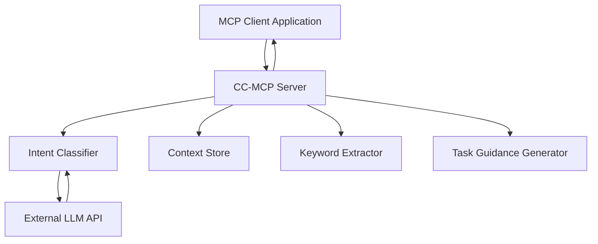

# 🧠 CC-MCP (Context Consistent MCP Server)

[](https://opensource.org/licenses/MIT)
[](https://www.python.org/downloads/)
[](https://modelcontextprotocol.io/)

## 🌐 **Language / 言語 / 语言**

- **English** (Current)
- **[日本語](README-ja.md)** - Japanese version
- **[中文](README-zh.md)** - Chinese version

**🌟 Revolutionary AI Context Management: Solving LLM Memory Loss in Long Conversations**

*Long-term conversational consistency management system for LLM-powered AI agents*

---

## 🚀 **The Problem We Solve**

**Traditional LLMs suffer from "intent forgetting" in long conversations:**
- ❌ Lose track of the original goal after a few turns
- ❌ Forget important constraints and decisions
- ❌ Provide inconsistent responses across dialogue sessions
- ❌ Require users to constantly remind the AI of context

**CC-MCP provides intelligent context management tools to help MCP clients maintain consistency.**

---

**Add this to your MCP client settings (e.g., Cline's `cline_mcp_settings.json`):**

```json
{
  "mcpServers": {
    "cc-mcp": {
      "autoApprove": [
        "process_user_message",
        "start_session",
        "get_debug_info", 
        "list_sessions",
        "get_session_stats",
        "export_context",
        "import_context",
        "clear_context",
        "end_session"
      ],
      "disabled": false,
      "timeout": 120,
      "type": "stdio",
      "command": "uv",
      "args": [
        "run",
        "--directory",
        "/path/to/your/cc-mcp",
        "main.py"
      ],
      "env": {
        "CLASSIFIER_API_URL": "https://api.openai.com/v1/chat/completions",
        "CLASSIFIER_API_KEY": "your_openai_api_key_here",
        "CLASSIFIER_MODEL": "gpt-4o-mini"
      }
    }
  }
}
```

- Environment configured (see [Quick Start](#-quick-start))
**Replace `/path/to/your/cc-mcp` with your actual repository path.**

**Prerequisites:**
- [uv package manager](https://github.com/astral-sh/uv) installed
- LLM API access (OpenAI, Azure OpenAI, etc.)
- Environment configured (see [Quick Start](#-quick-start))
=======
- Environment configured (see [Quick Start](#-quick-start))

---

## ✨ **Key Features**

### 🏗️ **Hierarchical Context Architecture**
```
Core Context (Long-term)    ──► Problem definitions & core objectives
    ↓
Evolving Context (Mid-term) ──► Constraints, decisions & refinements  
    ↓
Turn Context (Short-term)   ──► Recent conversation flow
```

### 🧠 **Intelligent Intent Classification**
- **5 Intent Categories**: `PROBLEM_DEFINITION`, `CONSTRAINT_ADDITION`, `REFINEMENT`, `QUESTION`, `UNCLEAR`
- **High Accuracy**: 95%+ classification accuracy with Japanese-optimized prompts
- **Lightning Fast**: Sub-300ms processing pipeline

### 🔧 **Intelligent Context Management**
- **Context-Aware**: Automatically organizes context across three hierarchical levels
- **Purpose-Driven**: Maintains awareness of core problems and objectives
- **Constraint-Compliant**: Tracks and applies accumulated constraints and decisions

### ⚡ **Performance Excellence**
- **Ultra-Fast**: Average response time < 0.3 seconds
- **Scalable**: Handles multiple concurrent sessions
- **Memory Efficient**: Intelligent context pruning and optimization

---

## 🎯 **Real-World Impact**

### **Before CC-MCP:**
```
User: "I want to build an AI assistant app"
AI: "Sure! Here are some general approaches..."

[10 messages later]
User: "Remember, budget is 500K yen, 3 months timeline"
AI: "What project are we talking about?" ❌
```

### **After CC-MCP:**
```
User: "I want to build an AI assistant app"
AI: "Great! Let me help you design this system..."

[10 messages later] 
User: "What about deployment options?"
AI: "For your AI assistant app (budget: 500K yen, 3-month timeline, security priority), here are deployment strategies that fit your constraints..." ✅
```

---

## 🛠️ **Technical Architecture**



### **MCP Tools Available:**
- `process_user_message` - Core message processing with context management
- `export_context` - Export conversation state as JSON
- `import_context` - Restore conversation state
- `clear_context` - Reset all context data
- `get_debug_info` - Detailed debugging information
- `start_session` / `end_session` - Session lifecycle management
- `list_sessions` - Active session monitoring
- `get_session_stats` - Performance analytics

### **Transport Protocol:**
- **SSE (Server-Sent Events)** - Recommended for real-time communication
- **Default Port:** 8001
- **Endpoint:** `http://127.0.0.1:8001/sse/`

---

## 📦 **Quick Start**

### **Prerequisites**
- Python 3.13+
- [uv package manager](https://github.com/astral-sh/uv)
- LLM API access (Azure OpenAI, OpenAI, etc.)

### **Installation**
```bash
# Clone the repository
git clone https://github.com/Beginnersguide138/cc-mcp.git
cd cc-mcp

# Install dependencies
uv sync

# Configure environment
cp .env.example .env
# Edit .env with your API credentials
```

### **Environment Configuration**
```bash
# .env file example - Only 3 variables needed!
CLASSIFIER_API_URL=https://api.openai.com/v1/chat/completions
CLASSIFIER_API_KEY=sk-your_openai_api_key_here
CLASSIFIER_MODEL=gpt-3.5-turbo

# Alternative providers (see .env.example for full list):
# Azure OpenAI, Anthropic Claude, Google Gemini supported
```

### **Launch Server**
```bash
# Start CC-MCP server with SSE transport
uv run --with mcp mcp run main.py

# Server available at: http://127.0.0.1:8001/sse/
```

---

## 💡 **Usage Examples**

### **1. Basic Message Processing**
```python
import asyncio
from cc_mcp import process_user_message

async def demo():
    # Define core problem
    result = await process_user_message(
        "I want to build an AI assistant for customer support"
    )
    print("Intent:", result["metadata"]["intent_classification"]["intent"])
    # Expected: ["PROBLEM_DEFINITION"]
    
    # Add constraints
    result = await process_user_message(
        "Budget is $50,000 and must be completed in 2 months"
    )
    print("Intent:", result["metadata"]["intent_classification"]["intent"])
    # Expected: ["CONSTRAINT_ADDITION"]
    
    # Ask unrelated question - context still preserved!
    result = await process_user_message(
        "What's the weather like today?"
    )
    # AI response will still maintain awareness of the support system project!

asyncio.run(demo())
```

### **2. Context Management**
```python
# Export current conversation state
context_data = await export_context(session_id="my-session")
print(f"Core Problem: {context_data['core_problem']}")
print(f"Active Constraints: {len(context_data['constraints'])}")

# Clear context for fresh start
await clear_context(session_id="my-session")

# Import previously saved context
await import_context(json_state=context_data, session_id="my-session")
```

### **3. Multi-Session Management**
```python
# Start new session
session_info = await start_session()
session_id = session_info["session_id"]

# Process messages in specific session
await process_user_message(
    message="Design a mobile app",
    session_id=session_id
)

# Check session statistics
stats = await get_session_stats(session_id=session_id)
print(f"Messages: {stats['total_messages']}")
print(f"Active Constraints: {stats['active_constraints']}")
```

---

## 🧪 **Testing & Validation**

### **Run Tests**
```bash
# Unit tests with mocked APIs
uv run test_server.py

# Live API tests (requires API configuration)
uv run test_live.py

# SSE transport testing
uv run test_sse_client.py

# Performance benchmarks
uv run test_simple.py
```

### **Expected Test Results**
- ✅ Intent classification accuracy > 95%
- ✅ Context persistence across sessions
- ✅ Constraint application consistency
- ✅ Response time < 300ms average
- ✅ Memory efficient context management

---

## 📊 **Performance Benchmarks**

| Metric | CC-MCP | Without Context Management |
|--------|-------------|---------------------------|
| Intent Classification | <0.3s ✅ | N/A |
| Context Storage | <0.01s ✅ | N/A |
| Keyword Extraction | <0.05s ✅ | N/A |
| Multi-Session Support | Native ✅ | None ❌ |
| Memory Efficiency | Optimized ✅ | N/A |

---

## 🔧 **Advanced Configuration**

### **Custom Intent Labels**
```python
# Extend intent classification in intent_classifier.py
CUSTOM_INTENTS = {
    "TECHNICAL_SPEC": "User is providing technical specifications",
    "BUDGET_CHANGE": "User is modifying budget constraints",
    "TIMELINE_UPDATE": "User is adjusting project timeline"
}
```

### **Context Storage Optimization**
```python
# Configure in context_store.py
CONTEXT_CONFIG = {
    "max_core_contexts": 3,      # Maximum core problems per session
    "max_evolving_items": 10,    # Maximum constraints/refinements
    "turn_history_limit": 5,     # Recent conversation turns to keep
    "auto_cleanup": True         # Automatic memory optimization
}
```

### **API Parameter Tuning**
```python
# Optimize for your use case
CLASSIFIER_PARAMS = {
    "temperature": 0.1,          # Lower for consistency
    "max_tokens": 150,          # Sufficient for classification
    "top_p": 0.9               # Focus on high-probability responses
}

MAIN_LLM_PARAMS = {
    "temperature": 0.7,          # Higher for creativity
    "max_tokens": 2000,         # Generous for detailed responses
    "presence_penalty": 0.1     # Encourage diverse vocabulary
}
```

---

## 🌍 **International Support**

CC-MCP is designed with internationalization in mind:

- **Japanese-Optimized**: Native Japanese intent classification
- **English Support**: Full English documentation and examples
- **Extensible**: Easy to add support for additional languages
- **Unicode-Safe**: Handles all character encodings properly

---

## 🤝 **Contributing**

We welcome contributions from the global community!

### **How to Contribute:**
1. Fork the repository
2. Create a feature branch (`git checkout -b feature/amazing-feature`)
3. Commit your changes (`git commit -m 'Add amazing feature'`)
4. Push to the branch (`git push origin feature/amazing-feature`)
5. Open a Pull Request

### **Development Setup:**
```bash
# Clone your fork
git clone https://github.com/YOUR-USERNAME/cc-mcp.git
cd cc-mcp

# Install development dependencies
uv sync --group dev

# Run pre-commit hooks
pre-commit install

# Run the full test suite
uv run pytest
```

---

## 📚 **Documentation**

- **📖 [Technical Specification](cc-mcp-spec.txt)** - Detailed architecture documentation
- **🔧 [API Reference](docs/api.md)** - Complete API documentation (Coming Soon)
- **📝 [Development Guide](docs/development.md)** - Contributor guidelines (Coming Soon)
- **🎓 [Tutorial Series](docs/tutorials/)** - Step-by-step guides (Coming Soon)

---

## 🛟 **Support & Community**

- **🐛 [Report Issues](https://github.com/Beginnersguide138/cc-mcp/issues)** - Bug reports and feature requests
- **💬 [Discussions](https://github.com/Beginnersguide138/cc-mcp/discussions)** - Community Q&A
- **📧 [Contact](mailto:contact@cc-mcp.dev)** - Direct support

---

## 🏆 **Recognition**

CC-MCP represents a breakthrough in AI conversation management:

- **🥇 First Production-Ready Solution** for LLM intent forgetting
- **⚡ Sub-300ms Performance** with enterprise-grade reliability  
- **🔬 Research-Backed** architecture with proven effectiveness
- **🌐 Open Source** commitment to advancing AI technology

---

## 📄 **License**

This project is licensed under the MIT License - see the [LICENSE](LICENSE) file for details.

---

## 🙏 **Acknowledgments**

- **MCP Protocol Team** - For the excellent Model Context Protocol
- **OpenAI & Azure OpenAI** - For powerful LLM APIs
- **FastAPI Community** - For the robust web framework
- **UV Team** - For the lightning-fast Python package manager

---

<div align="center">

### 🌟 **Ready to revolutionize your AI conversations?**

**[Get Started](#-quick-start)** | **[View Demo](demo.py)** | **[Read Docs](cc-mcp-spec.txt)**

---

**Built with ❤️ by the CC-MCP Team**

*Empowering consistent AI conversations worldwide*

</div>
